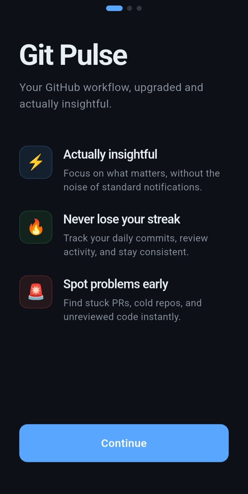

# Git Pulse

Git Pulse is a beautiful Flutter application designed to track your GitHub activity, commit streaks, and pull request contributions in an elegant dashboard.

## Overview

Keep a close eye on your open source and private repository activity. Git Pulse offers insights such as:
- **Activity Heatmap**: Visualize your commit history over the last 90 days across all your repositories.
- **Commit Streaks**: Track your current and longest commit streaks, keeping your momentum going.
- **Pull Request Contributions**: View your PR review and merge statistics.
- **Dark/Light Mode**: Adjust the dashboard perfectly to your preferences.

---

## Onboarding Screens

### 1. Screen 1



### 2. Screen 2


### 3. Screen 3


---

## Getting Started

### Prerequisites

- [Flutter SDK](https://docs.flutter.dev/get-started/install) (latest stable version recommended)
- Dart SDK
- A GitHub Personal Access Token (Classic) with the `repo` scope to enable tracking for private repository activity.

### Installation

1. **Clone the repository:**
   ```bash
   git clone https://github.com/yourusername/git_pulse.git
   ```

2. **Navigate to the project directory:**
   ```bash
   cd git_pulse
   ```

3. **Install dependencies:**
   ```bash
   flutter pub get
   ```

4. **Run the application:**
   ```bash
   flutter run
   ```

## Contributing

Contributions are welcome! Please feel free to fork the repository and submit a Pull Request if you'd like to add new features or enhancements.

## License

This project is licensed under the MIT License.
